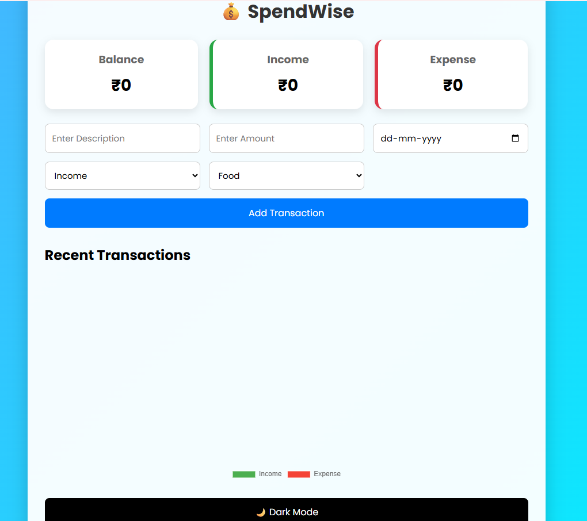
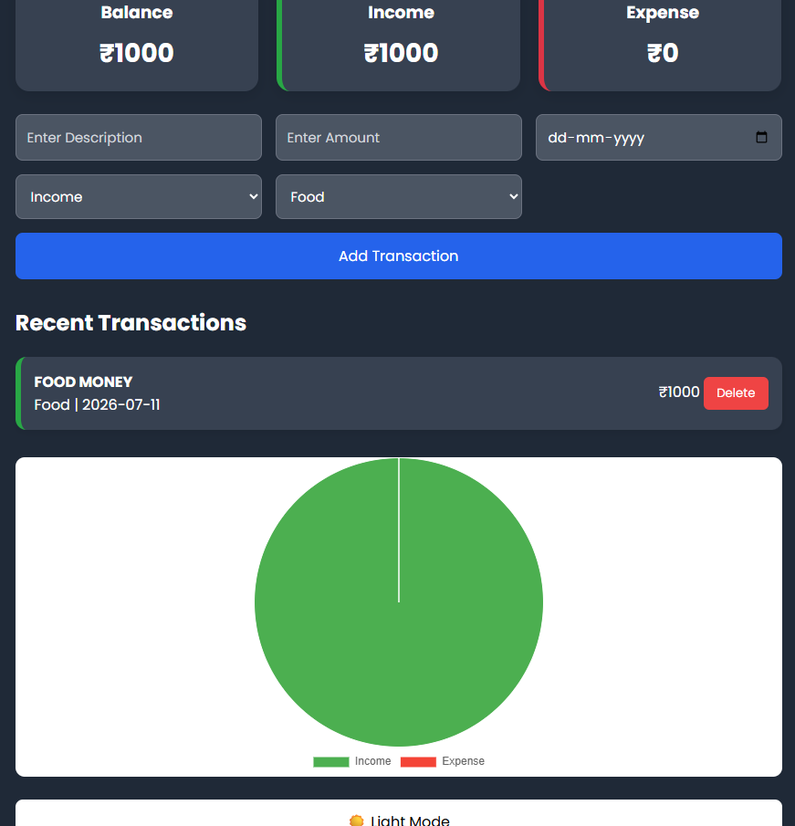

# 💰 SpendWise - Expense Tracker

A modern and responsive **Expense Tracker** web application built using **HTML, CSS, and JavaScript**. SpendWise helps users track their income and expenses, monitor their financial balance, and visualize spending through interactive charts.

[](https://YOUR_USERNAME.github.io/SpendWise/)
[](https://github.com/YOUR_USERNAME/SpendWise)

## 📖 About
SpendWise is a simple yet powerful personal finance management application designed to help users record daily income and expenses. It automatically calculates the total balance, displays financial summaries, and visualizes spending using charts. All transaction data is stored locally in the browser using **Local Storage**, ensuring data persists even after refreshing the page.
## ✨ Features

- 💰 Add Income and Expenses
- 📊 Interactive Pie Chart
- 📅 Date-wise Transaction Management
- 🗂 Expense Categories
- 🗑 Delete Transactions
- 💾 Local Storage Support
- 🌙 Dark Mode
- 📱 Fully Responsive Design
## 🛠 Tech Stack
- HTML5
- CSS3
- JavaScript (ES6)
- Chart.js
- Local Storage
## 📂 Project Structure

```text
SpendWise
│── index.html
│── style.css
│── script.js
│── README.md
│── .gitignore
│── screenshots/
│     ├── home.png
│     └── dashboard.png
```

---

## 🚀 Getting Started

1. Clone the repository

```bash
git clone https://github.com/YOUR_USERNAME/SpendWise.git
```
2. Open the project folder.
3. Open **index.html** in your browser.
No additional installation is required.
## 📸 Screenshots
### 🏠 Home Page



### 📈 Dashboard



---

## 🎯 Future Enhancements

- 🔍 Search Transactions
- ✏️ Edit Transactions
- 📤 Export to CSV/PDF
- 📅 Monthly Reports
- ☁️ Cloud Database Integration
- 🔐 User Authentication

---

## 👨‍💻 Author

**Dharavath Eeshwar**

GitHub: [https://github.com/Eeshward](https://github.com/Eeshward)

---

## 📄 License

This project is licensed under the MIT License.
